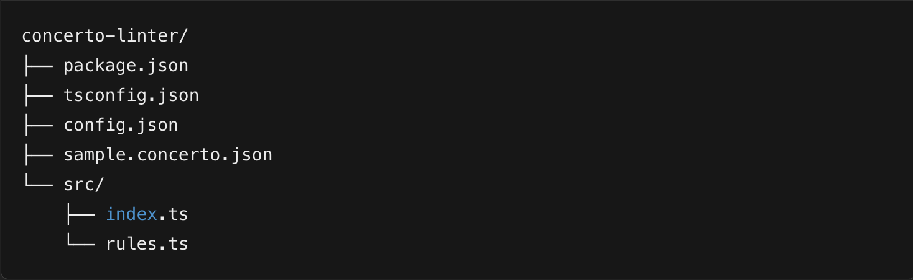
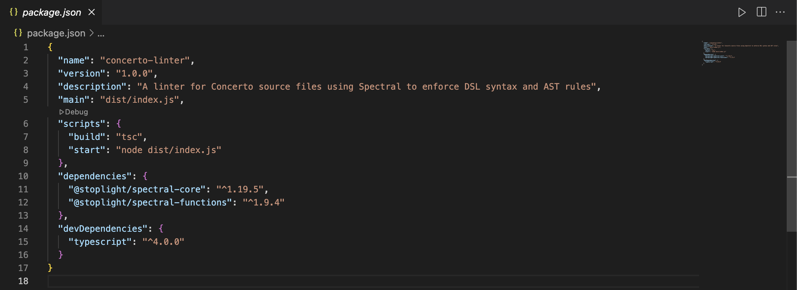
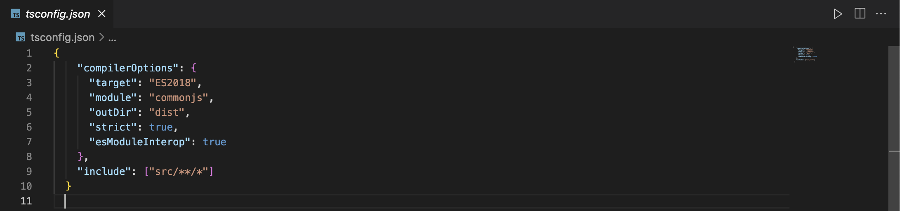
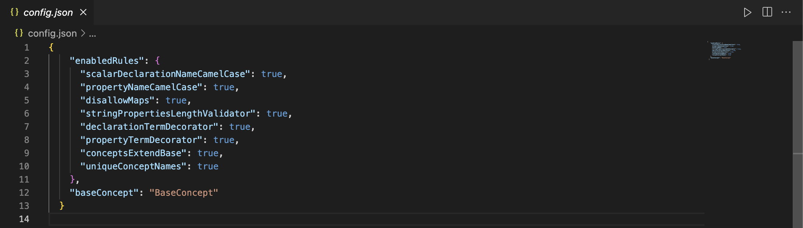
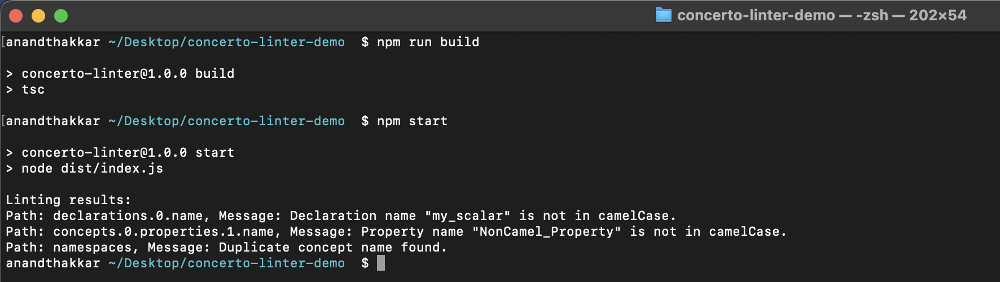

# GSoC 2025 Project Proposal

## Linter for Concerto

### _Medium Project_

#### About Me

\begin{flushleft}
\begin{tabular}{|l|p{10cm}|}
\hline
\textbf{Field} & \textbf{Details} \\
\hline
Name & Anand Thakkar \\
\hline
Email & anand.thakkar92@gmail.com \\
\hline
Organisation & Agile Infoways Pvt Ltd \\
\hline
LinkedIn & \url{https://www.linkedin.com/in/theanandthakkar} \\
\hline
GitHub & \url{https://github.com/TheAnandThakkar} \\
\hline
Twitter & \url{https://x.com/TheAnandThakkar} \\
\hline
Timezone & IST (GMT +05:30) \\
\hline
\end{tabular}
\end{flushleft}

\begin{flushright}
{\footnotesize\itshape
Note: I have created and hosted this project locally to better understand the Spectral framework and how to define validation rules for Concerto. I am not submitting a pull request at this stage but have shared the GitHub repository for review purposes: \url{https://github.com/TheAnandThakkar/concerto-linter}
}
\end{flushright}

\newpage

## 1. Abstract

This project aims to develop a configurable linter for Concerto source files using NodeJS and TypeScript. Leveraging Spectral as the core rule engine, the linter validates Concerto DSL syntax and the JSON AST against a robust set of rules. These rules enforce best practices—such as camelCase naming, language feature restrictions (e.g., disallowing map types), required field validators (e.g., string length validators), and mandatory decorators (e.g., `@Term`)—while also ensuring that every concept extends a specified base concept and maintains uniqueness across namespaces. The tool will significantly improve the quality and consistency of legal agreement models within the Accord Project.

## 2. Motivation & Why Choose Accord?

In my current project, I implemented third-party APIs to generate loan agreements and to send these agreements for signature using Aadhar OTP. During this process, I encountered several challenges:

- **Template Flexibility:**  
  The loan agreement templates were rigid and lacked flexibility.
- **Field Validations:**  
  Inadequate validations led to null safety issues and, in some cases, invalid objects from APIs (e.g., Bank Penniless API, Aadhar to PAN API).
- **Data Integrity:**  
  Missing validations sometimes caused errors, resulting in unreliable outputs.

Although I’m new to the Accord Project, I believe my expertise in backend development, NodeJS, functional programming, and TypeScript can be applied effectively to optimize legal agreements. I see tremendous potential to enhance these models by building a robust linter that enforces strict, configurable validations, thereby ensuring high-quality and consistent contracts.

## 3. What Needs to Be Done

The linter will:

- **Validate Naming Conventions:**
  - Enforce camelCase for scalar declarations and properties.
- **Restrict Unsupported Language Features:**
  - Disallow unsupported features, such as map types (with future extension possibilities).
- **Enforce Field Validators:**
  - Require that all string properties include a length validator.
- **Mandate Decorator Usage:**
  - Ensure every declaration and property includes an `@Term` decorator.
- **Verify Inheritance & Uniqueness:**
  - Confirm that each concept in a namespace extends a given base concept.
  - Ensure concept names are unique across namespaces.

## 4. How

1. **Project Setup:**
   - Develop the tool using NodeJS and TypeScript.
   - Use Spectral (`@stoplight/spectral-core` and `@stoplight/spectral-functions`) to define validation rules.
2. **Configuration:**
   - Implement a JSON configuration file (`config.json`) for enabling/disabling specific rules.
3. **Validation Rules:**
   - Write validation rules in `src/rules.ts`, including both built-in checks (e.g., pattern matching for camelCase) and custom functions (e.g., uniqueness checks).
4. **Entry Point:**
   - Develop `src/index.ts` to load configuration, parse a sample Concerto model (`sample.concerto.json`), apply validations, and output errors.
5. **Testing & Iteration:**
   - Use a sample Concerto model with intentional errors to test the linter.
   - Capture and include screenshots of code and terminal outputs for documentation.

## 5. Implementation Plan & Timeline

### Phase 1: Research & Initial Design (Weeks 1–2)

- Study the Concerto DSL and existing validation practices.
- Define the overall architecture and integration plan with Spectral.

### Phase 2: Prototype Development (Weeks 3–6)

- Set up the project structure.
- Implement core validation rules and configuration.
- Develop a sample model with intentional errors for testing.

### Phase 3: Feature Expansion & Testing (Weeks 7–10)

- Expand the rule set with additional custom validations.
- Write comprehensive tests and refine error reporting.
- Gather mentor feedback and iterate on the implementation.

### Phase 4: Documentation & Community Engagement (Weeks 11–12)

- Prepare detailed documentation and user guides.
- Publish weekly updates on a public blog or GitHub repo.
- Incorporate community feedback and finalize the project.

## 6. Technical Approach & Justification

- **Technologies Chosen:**  
  NodeJS and TypeScript for their robust development ecosystem and strong typing, and Spectral for its flexible rule engine.
- **Justification:**  
  Spectral allows us to define both built-in and custom validations in a clear, modular fashion. TypeScript ensures maintainable code, while NodeJS provides a scalable runtime for the linter.
- **Architecture:**  
  The project is structured with a clear separation of concerns—configuration, rule definitions, and an orchestration entry point—ensuring modularity and ease of future enhancements.

## 7. Learning Outcomes & Impact

- **Technical Proficiency:**  
  Enhance skills in NodeJS, TypeScript, and functional programming.
- **Spectral Mastery:**  
  Gain expertise in extending Spectral’s rule engine for domain-specific validations.
- **Project Design:**  
  Learn best practices for creating modular and configurable developer tools.
- **Documentation & Communication:**  
  Improve documentation skills and community engagement through regular updates.
- **Industry Impact:**  
  Contribute to higher-quality legal agreements by ensuring data integrity and consistent model validations.

## 8. Documentation & Reporting

- **Weekly Updates:**  
  I will update my progress weekly on a public blog or GitHub repository.
- **Detailed Guides:**  
  Additional markdown files will be provided to explain functionalities, if required by the mentor.
- **Mentor Communication:**  
  Regular interactions will ensure continuous improvement and alignment with project goals.

\newpage

## Appendices

### A. Project Structure

Below is the screenshot of the complete project structure:

---

### B. Screenshots, Descriptions & Purposes

#### 1. package.json

_Description & Purpose:_  
Defines project metadata, dependencies (Spectral and TypeScript), and build scripts. Essential for setting up the development environment.

---

#### 2. tsconfig.json

_Description & Purpose:_  
Configures the TypeScript compiler options (target version, module system, output directory, strict mode) to ensure consistent code compilation.

---

#### 3. config.json

_Description & Purpose:_  
Provides configuration options to enable/disable validation rules and sets parameters like the required base concept. Offers flexibility in adapting the linter to various project needs.

---

#### 4. sample.concerto.json

_Description & Purpose:_  
This file contains a sample Concerto model in JSON Abstract Syntax Tree (AST) format. It includes intentional errors such as:

- Declarations and properties that do not follow camelCase naming
- Properties missing length validators
- Concepts with duplicate names across namespaces
- Missing `@Term` decorators

By using this model as test input for the linter, we ensure each rule is triggered and verified during development. It also serves as a demonstration when showing how the linter identifies real-world issues.

---

#### 5. src/rules.ts

_Description & Purpose:_  
This file contains the core Spectral rule definitions. It uses both built-in and custom functions to validate the Concerto model against the configuration. Key functionality includes:

- Enforcing naming conventions using regex for camelCase
- Validating presence of length validators on string properties
- Ensuring `@Term` decorators are present
- Checking for duplicate concept names across namespaces
- Verifying that all concepts extend a specific base concept

This is the logic engine of the linter and is designed to be modular, extendable, and easy to maintain.

---

#### 6. src/index.ts

_Description & Purpose:_  
The main entry point for the CLI linter. It orchestrates the full validation process:

1. Loads settings from `config.json`
2. Loads the sample Concerto model
3. Applies active Spectral rules
4. Collects and prints validation errors to the terminal

This file makes the tool configurable and ready to use from the command line, and supports future scalability (e.g., parsing `.cto` directly or validating multiple files).

---

#### 7. Terminal Output

_Description & Purpose:_  
Displays error messages (such as non-camelCase names and duplicate concepts) confirming that the linter correctly identifies issues in the sample model.

---

## Personal Background

**Education:**

- **MSCIT** – BAOU (Oct - 2023)  
  CGPA: 8.83/10

**Work Experience:**

- **Software Developer** (May 2022 – present)  
  Mostly working upon JAVA & JavaScript frameworks.

**Cloud & Technology:**

- AWS (EC2, DynamoDB, S3, SES, Lambda), Kubernetes, Docker, AWS Certified Cloud Practitioner (CLF-C02).

---

## Additional Information

- **Are you planning to vacation this summer?**  
  No.
- **How many hours per week do you expect to work on the project?**  
  Approximately 24–25 hours per week.
- **Future Work/After GSoC:**  
  I plan to continue contributing to the Accord Project by submitting pull requests, refining the linter, and staying engaged with the community to enhance the tool.

---

## A Note on AI Assistance

> **Transparency Statement:**  
> While preparing this project and proposal, I explored and learned how to use the Spectral framework and how to write validation rules in `rules.ts` with the help of AI-based tools (such as ChatGPT).
>
> These tools helped me understand key concepts faster and clarify unfamiliar syntax. However, all the code, configuration, and documentation were written and organized by me.
>
> I believe in being transparent and honest about the resources I use to improve my understanding, and I hope this reflects my genuine interest in the project and willingness to learn.

---

_End of Proposal_
